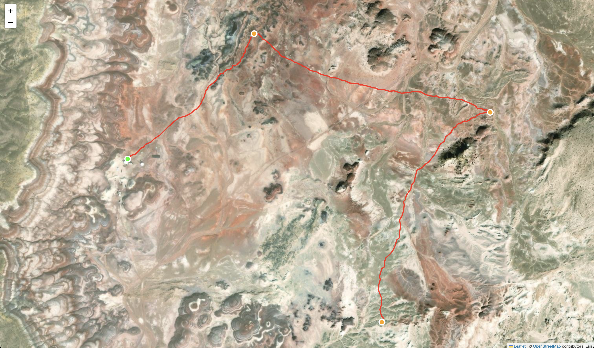
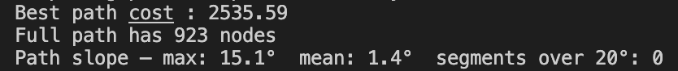

# Wisconsin Robotics — URC Autonomous Path Planner

Terrain-aware autonomous path planner for the [University Rover Challenge](https://urc.marssociety.org/). Given a LiDAR scan and GPS waypoints, it computes the safest traversable route across all targets while respecting the rover's slope limits.

---

## How It Works

| Stage | What happens |
|---|---|
| **Point cloud cleaning** | Voxel hash filter downsamples the scan; sparse cells are dropped as noise |
| **Graph construction** | KDTree KNN graph is built; edges steeper than `MAX_SLOPE_DEG` are rejected |
| **Waypoint snapping** | GPS coordinates are projected into the LiDAR frame and snapped to the nearest connected node |
| **Path planning** | A\* is run between every pair of waypoints to build a full cost matrix |
| **Route optimization** | Brute-force TSP finds the optimal visit order across all targets |
| **Visualization** | The route is rendered as an interactive satellite map and saved to `path_output.html` |

## Pipeline

```
.laz file
    └── load_and_clean_lidar()        voxel hash filter, outlier removal, max-Z selection
            └── build_knn()           KDTree + K nearest neighbors
                    └── build_graph_vectorized()    slope-weighted adjacency list
                            └── GPS waypoints
                                    └── find_nearest_node()     2D snap to graph
                                            └── compute_cost_matrix()   pairwise A*
                                                    └── find_best_order()   brute-force TSP
                                                            └── visualize_path()    folium HTML map
```

## File Structure

```
├── main.py                         entry point
├── configs/
│   └── settings.py                 tunable parameters
├── src/
│   ├── pointcloud/
│   │   ├── load_clean.py           voxel hash filter + outlier removal
│   │   └── knn_builder.py          KDTree construction + KNN query
│   ├── pathplanning/
│   │   ├── graph_builder.py        vectorized slope-weighted graph
│   │   ├── astar.py                A* with 3D Euclidean heuristic
│   │   └── multi_target.py         cost matrix, TSP, path stitching
│   └── utils/
│       ├── geo_helpers.py          vectorized edge weight computation
│       ├── nearest_point.py        GPS-to-graph node snapping
│       ├── point_conversion.py     EPSG detection, GPS to projected XY
│       └── visualization.py        folium map output
├── testing/
│   ├── test_pipeline.py            load + KNN + graph pipeline test
│   └── graph_stats.py              node and edge degree statistics
└── docs/
    └── documentation.pdf           full technical writeup
```

## Installation

```bash
pip install "laspy[lazrs]" numpy scipy pyproj folium
```

## Usage

```bash
python main.py
```

Prompts:
1. Path to a `.laz` / `.las` LiDAR file
2. Start point GPS coordinates (`lat lon`)
3. Number of targets and GPS coordinates for each

Outputs slope statistics to the terminal and saves the route as `path_output.html`.

## Configuration

Edit `configs/settings.py`:

| Parameter | Default | Effect |
|---|---|---|
| `K_NEIGHBORS` | `10` | KNN edges per point |
| `MAX_SLOPE_DEG` | `36` | Slope limit in degrees; steeper edges are rejected |
| `SLOPE_MULTIPLIER` | `5` | Slope penalty weight relative to flat distance |

## Test Results

Tested on a real LiDAR scan of the MDRS (Mars Desert Research Station) site in Utah with 1 start point and 3 targets.

**Planned route** — green dot is start, orange dots are targets:



**Path statistics:**



| Metric | Value |
|---|---|
| Path cost | 2535.59 |
| Total nodes | 923 |
| Max slope | 15.1° |
| Mean slope | 1.4° |
| Segments over 20° | 0 |

## Documentation

Algorithm derivations, voxel size selection, complexity analysis, and coordinate system notes are in [`docs/documentation.pdf`](docs/documentation.pdf).
